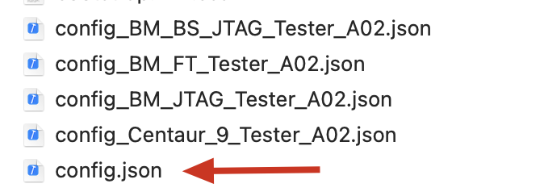

# TESTER CONTROL API

Supports four test stations: BS_JTAG, JTAG, FT, Centaur-9. Used for automated control and status monitoring.

---

## 1. Configuration Instructions

All configuration files are located in the `/static/` directory.

- **Main configuration file**: `/static/config.json`
- Each test station has its own configuration, such as `config_BS_JTAG.json`. Please rename the corresponding file to `config.json` when in use.
- 

---

## 2. Start the API Service

1. Double-click `FT_API.exe` on the desktop to start the API program.

2. After startup, a GUI window will automatically open. This is the core service process for API and user interfaces. All API functions and user interfaces depend on this process, so please keep it running at all times.
   
   

---

## 3. IO_SETTING Configuration Instructions

Corresponds one-to-one with the PLC_IO_List Excel file.

| Field       | Description             |
| ----------- | ----------------------- |
| PLC         | IO number (e.g. M2000)  |
| description | IO function description |


---

## 4. ACTION_SETTING Configuration Instructions


### Control Action

- **Action Name**: Lowercase letters, no spaces, must contain underscores. Format: `functionname_statename`, e.g., `clamp_x_in`, `power_on`.
- **Description**: The IO used, e.g., `M2000`.
- **readonly**: `false` or omitted.
- **Command List**:
  - **PLC**: Select the corresponding IO, e.g., `M2000`.
  - **Type**:
    - `write_multiple_coil`
    - `read_multiple_coil`
    - `write_single_coil`
    - `read_single_coil`
    - `read_holding_registers`
    - `write_holding_registers`
    - Please confirm the specific selection with the PLC engineer
  - **Delay(s)**: Delay after write operation, default is 0. For read operations, this is the timeout; within the timeout, the system loops until the target value is reached.
  - **Expected**: Target value. Single coil: 0 or 1. Multiple coils: `0,1` or `1,0`.

### State Action

- **Action Name**: Lowercase letters, no spaces, must contain underscores. Format: `functionname_state`, e.g., `clamp_x_in_state`.
- **Description**: Optional values for the state, e.g., `on_off`, `engage_disengage`, `up_down`.
- **readonly**: `true`
- **Command List**:
  - **PLC**: Select the corresponding IO, e.g., `M2000`.
  - **Type**:
    - `read_multiple_coil`
    - `read_single_coil`
    - `read_holding_registers`
    - Please confirm the specific selection with the PLC engineer
  - **Delay(s)**: Timeout for read operations; within the timeout, the system loops until the target value is reached.
  - **Expected**: Target value. Single coil: 0 or 1. Multiple coils: `0,1` or `1,0`.

---

## 5. Action Control


## 6. Action Status


---

For detailed help, please contact the project maintainer or refer to the relevant documentation.

---

## 6. All cURL Commands and Responses

### 6.1 BM_FT Test Station

```sh
# The following content is from Log/cURL_BM_FT.txt
# Each command is immediately followed by its response

curl -X POST --url http://192.168.10.30:5001/set_control -H "content-type: application/json"-d "{\"control_name\": \"clamp_x\", \"control_state\": \"in\"}"
{"state": "in", "result": true, "status": ""}

curl -X POST --url http://192.168.10.30:5001/set_control -H "content-type: application/json"-d "{\"control_name\": \"clamp_y\", \"control_state\": \"in\"}"
{"state": "in", "result": true, "status": ""}

curl -X POST --url http://192.168.10.30:5001/set_control -H "content-type: application/json"-d "{\"control_name\": \"lifter\", \"control_state\": \"up\"}"
{"state": "up", "result": true, "status": ""}

curl -X POST --url http://192.168.10.30:5001/set_control -H "content-type: application/json"-d "{\"control_name\": \"power\", \"control_state\": \"in\"}"
{"state": "in", "result": true, "status": ""}

curl -X POST --url http://192.168.10.30:5001/set_control -H "content-type: application/json"-d "{\"control_name\": \"power\", \"control_state\": \"out\"}"
{"state": "out", "result": true, "status": ""}

curl -X POST --url http://192.168.10.30:5001/set_control -H "content-type: application/json"-d "{\"control_name\": \"osfp1\", \"control_state\": \"in\"}"
{"state": "in", "result": true, "status": ""}

curl -X POST --url http://192.168.10.30:5001/set_control -H "content-type: application/json"-d "{\"control_name\": \"osfp1\", \"control_state\": \"out\"}"
{"state": "out", "result": true, "status": ""}

curl -X POST --url http://192.168.10.30:5001/set_control -H "content-type: application/json"-d "{\"control_name\": \"osfp1_speediness\", \"control_state\": \"disable\"}"
{"state": "disable", "result": true, "status": ""}

curl -X POST --url http://192.168.10.30:5001/set_control -H "content-type: application/json"-d "{\"control_name\": \"osfp1_speediness\", \"control_state\": \"enable\"}"
{"state": "enable", "result": true, "status": ""}

curl -X POST --url http://192.168.10.30:5001/set_control -H "content-type: application/json"-d "{\"control_name\": \"osfp2_speediness\", \"control_state\": \"disable\"}"
{"state": "disable", "result": true, "status": ""}

curl -X POST --url http://192.168.10.30:5001/set_control -H "content-type: application/json"-d "{\"control_name\": \"osfp2_speediness\", \"control_state\": \"enable\"}"
{"state": "enable", "result": true, "status": ""}

curl -X POST --url http://192.168.10.30:5001/set_control -H "content-type: application/json"-d "{\"control_name\": \"osfp2\", \"control_state\": \"in\"}"
{"state": "in", "result": true, "status": ""}

curl -X POST --url http://192.168.10.30:5001/set_control -H "content-type: application/json"-d "{\"control_name\": \"osfp2\", \"control_state\": \"out\"}"
{"state": "out", "result": true, "status": ""}

curl -X POST --url http://192.168.10.30:5001/set_control -H "content-type: application/json"-d "{\"control_name\": \"osfp3\", \"control_state\": \"in\"}"
{"state": "in", "result": true, "status": ""}

curl -X POST --url http://192.168.10.30:5001/set_control -H "content-type: application/json"-d "{\"control_name\": \"osfp3\", \"control_state\": \"out\"}"
{"state": "out", "result": true, "status": ""}

curl -X POST --url http://192.168.10.30:5001/set_control -H "content-type: application/json"-d "{\"control_name\": \"osfp3_speediness\", \"control_state\": \"disable\"}"
{"state": "disable", "result": true, "status": ""}

curl -X POST --url http://192.168.10.30:5001/set_control -H "content-type: application/json"-d "{\"control_name\": \"osfp3_speediness\", \"control_state\": \"enable\"}"
{"state": "enable", "result": true, "status": ""}

curl -X POST --url http://192.168.10.30:5001/set_control -H "content-type: application/json"-d "{\"control_name\": \"osfp4\", \"control_state\": \"in\"}"
{"state": "in", "result": true, "status": ""}

curl -X POST --url http://192.168.10.30:5001/set_control -H "content-type: application/json"-d "{\"control_name\": \"osfp4\", \"control_state\": \"out\"}"
{"state": "out", "result": true, "status": ""}

curl -X POST --url http://192.168.10.30:5001/set_control -H "content-type: application/json"-d "{\"control_name\": \"osfp4_speediness\", \"control_state\": \"disable\"}"
{"state": "disable", "result": true, "status": ""}

curl -X POST --url http://192.168.10.30:5001/set_control -H "content-type: application/json"-d "{\"control_name\": \"osfp4_speediness\", \"control_state\": \"enable\"}"
{"state": "enable", "result": true, "status": ""}

curl -X POST --url http://192.168.10.30:5001/set_control -H "content-type: application/json"-d "{\"control_name\": \"osfp5\", \"control_state\": \"in\"}"
{"state": "in", "result": true, "status": ""}

curl -X POST --url http://192.168.10.30:5001/set_control -H "content-type: application/json"-d "{\"control_name\": \"osfp5\", \"control_state\": \"out\"}"
{"state": "out", "result": true, "status": ""}

curl -X POST --url http://192.168.10.30:5001/set_control -H "content-type: application/json"-d "{\"control_name\": \"osfp5_speediness\", \"control_state\": \"disable\"}"
{"state": "disable", "result": true, "status": ""}

curl -X POST --url http://192.168.10.30:5001/set_control -H "content-type: application/json"-d "{\"control_name\": \"osfp5_speediness\", \"control_state\": \"enable\"}"
{"state": "enable", "result": true, "status": ""}

curl -X POST --url http://192.168.10.30:5001/set_control -H "content-type: application/json"-d "{\"control_name\": \"osfp6\", \"control_state\": \"in\"}"
{"state": "in", "result": true, "status": ""}

curl -X POST --url http://192.168.10.30:5001/set_control -H "content-type: application/json"-d "{\"control_name\": \"osfp6\", \"control_state\": \"out\"}"
{"state": "out", "result": true, "status": ""}

curl -X POST --url http://192.168.10.30:5001/set_control -H "content-type: application/json"-d "{\"control_name\": \"osfp6_speediness\", \"control_state\": \"disable\"}"
{"state": "disable", "result": true, "status": ""}

curl -X POST --url http://192.168.10.30:5001/set_control -H "content-type: application/json"-d "{\"control_name\": \"osfp6_speediness\", \"control_state\": \"enable\"}"
{"state": "enable", "result": true, "status": ""}

curl -X POST --url http://192.168.10.30:5001/set_control -H "content-type: application/json"-d "{\"control_name\": \"osfp7\", \"control_state\": \"in\"}"
{"state": "in", "result": true, "status": ""}

curl -X POST --url http://192.168.10.30:5001/set_control -H "content-type: application/json"-d "{\"control_name\": \"osfp7\", \"control_state\": \"out\"}"
{"state": "out", "result": true, "status": ""}

curl -X POST --url http://192.168.10.30:5001/set_control -H "content-type: application/json"-d "{\"control_name\": \"osfp7_speediness\", \"control_state\": \"disable\"}"
{"state": "disable", "result": true, "status": ""}

curl -X POST --url http://192.168.10.30:5001/set_control -H "content-type: application/json"-d "{\"control_name\": \"osfp7_speediness\", \"control_state\": \"enable\"}"
{"state": "enable", "result": true, "status": ""}

curl -X POST --url http://192.168.10.30:5001/set_control -H "content-type: application/json"-d "{\"control_name\": \"osfp8\", \"control_state\": \"in\"}"
{"state": "in", "result": true, "status": ""}

curl -X POST --url http://192.168.10.30:5001/set_control -H "content-type: application/json"-d "{\"control_name\": \"osfp8\", \"control_state\": \"out\"}"
{"state": "out", "result": true, "status": ""}

curl -X POST --url http://192.168.10.30:5001/set_control -H "content-type: application/json"-d "{\"control_name\": \"osfp8_speediness\", \"control_state\": \"disable\"}"
{"state": "disable", "result": true, "status": ""}

curl -X POST --url http://192.168.10.30:5001/set_control -H "content-type: application/json"-d "{\"control_name\": \"osfp8_speediness\", \"control_state\": \"enable\"}"
{"state": "enable", "result": true, "status": ""}

curl -X POST --url http://192.168.10.30:5001/set_control -H "content-type: application/json"-d "{\"control_name\": \"osfp9\", \"control_state\": \"in\"}"
{"state": "in", "result": true, "status": ""}

curl -X POST --url http://192.168.10.30:5001/set_control -H "content-type: application/json"-d "{\"control_name\": \"osfp9\", \"control_state\": \"out\"}"
{"state": "out", "result": true, "status": ""}

curl -X POST --url http://192.168.10.30:5001/set_control -H "content-type: application/json"-d "{\"control_name\": \"osfp9_speediness\", \"control_state\": \"disable\"}"
{"state": "disable", "result": true, "status": ""}

curl -X POST --url http://192.168.10.30:5001/set_control -H "content-type: application/json"-d "{\"control_name\": \"osfp9_speediness\", \"control_state\": \"enable\"}"
{"state": "enable", "result": true, "status": ""}

curl -X POST --url http://192.168.10.30:5001/set_control -H "content-type: application/json"-d "{\"control_name\": \"eth_usb\", \"control_state\": \"in\"}"
{"state": "in", "result": true, "status": ""}

curl -X POST --url http://192.168.10.30:5001/set_control -H "content-type: application/json"-d "{\"control_name\": \"eth_usb\", \"control_state\": \"out\"}"
{"state": "out", "result": true, "status": ""}

curl -X POST --url http://192.168.10.30:5001/set_control -H "content-type: application/json"-d "{\"control_name\": \"fnm\", \"control_state\": \"in\"}"
{"state": "in", "result": true, "status": ""}

curl -X POST --url http://192.168.10.30:5001/set_control -H "content-type: application/json"-d "{\"control_name\": \"fnm\", \"control_state\": \"out\"}"
{"state": "out", "result": true, "status": ""}

curl -X POST --url http://192.168.10.30:5001/set_control -H "content-type: application/json"-d "{\"control_name\": \"eth_usb_led\", \"control_state\": \"in\"}"
{"state": "", "result": false, "status": "Command M10295 executed failed: Actual value (0, 0) does not match expected value [0, 1]"}

curl -X POST --url http://192.168.10.30:5001/get_control -H "content-type: application/json"-d "{\"control_name\": \"manual_auto\"}"
{"state": "on", "result": true, "status": ""}

curl -X POST --url http://192.168.10.30:5001/set_control -H "content-type: application/json"-d "{\"control_name\": \"plc\", \"control_state\": \"start\"}"
{"state": "start", "result": false, "status": "Command D6 executed failed: Actual value (4,) does not match expected value [1]"}

#Note: command only availble at auto mode

curl -X POST --url http://192.168.10.30:5001/set_control -H "content-type: application/json"-d "{\"control_name\": \"plc\", \"control_state\": \"stop\"}"
{"state": "stop", "result": true, "status": ""}

#Note: command only availble at auto mode

curl -X POST --url http://192.168.10.30:5001/set_control -H "content-type: application/json"-d "{\"control_name\": \"dut\", \"control_state\": \"engage\"}"
{"state": "engage", "result": ture, "status": ""}

#Note: command only availble at auto mode


curl -X POST --url http://192.168.10.30:5001/set_control -H "content-type: application/json"-d "{\"control_name\": \"dut\", \"control_state\": \"disengage\"}"
{"state": "disengage", "result": true, "status": ""}

#Note: command only availble at auto mode


curl -X POST --url http://192.168.10.30:5001/set_control -H "content-type: application/json"-d "{\"control_name\": \"buzzer\", \"control_state\": \"enable\"}"
{"state": "enable", "result": true, "status": ""}

curl -X POST --url http://192.168.10.30:5001/set_control -H "content-type: application/json"-d "{\"control_name\": \"buzzer\", \"control_state\": \"disable\"}"
{"state": "disable", "result": true, "status": ""}

curl -X POST --url http://192.168.10.30:5001/get_control -H "content-type: application/json"-d "{\"control_name\": \"test_ready\"}"
{"state": "off", "result": false, "status": "Command M10613 executed failed: Actual value (0,) does not match expected value [1]"}

curl -X POST --url http://192.168.10.30:5001/get_control -H "content-type: application/json"-d "{\"control_name\": \"device_status\"}"
{"state": "off", "result": false, "status": "Command D6 executed failed: Actual value (4,) does not match expected value [-1]"}

curl -X POST --url http://192.168.10.30:5001/get_control -H "content-type: application/json"-d "{\"control_name\": \"reset_flow\"}"
{"state": "off", "result": false, "status": "Command D7 executed failed: Actual value (0,) does not match expected value [-1]"}

curl -X POST --url http://192.168.10.30:5001/get_control -H "content-type: application/json"-d "{\"control_name\": \"auto_flow\"}"
{"state": "off", "result": false, "status": "Command D8 executed failed: Actual value (1,) does not match expected value [-1]"}

curl -X POST --url http://192.168.10.30:5001/get_control -H "content-type: application/json"-d "{\"control_name\": \"alarm\"}"
{"state": "off", "result": false, "status": "Command D150 executed failed: Actual value (0,) does not match expected value [-1]"}

curl -X POST --url http://192.168.10.30:5001/get_control -H "content-type: application/json"-d "{\"control_name\": \"tray_in_1\"}"
{"state": "on", "result": true, "status": ""}

curl -X POST --url http://192.168.10.30:5001/get_control -H "content-type: application/json"-d "{\"control_name\": \"tray_in_2\"}"
{"state": "on", "result": true, "status": ""}

curl -X POST --url http://192.168.10.30:5001/get_control -H "content-type: application/json"-d "{\"control_name\": \"clamp_x1_home\"}"
{"state": "off", "result": false, "status": "Command M11003 executed failed: Actual value (0,) does not match expected value [1]"}

curl -X POST --url http://192.168.10.30:5001/get_control -H "content-type: application/json"-d "{\"control_name\": \"clamp_x1_in_place\"}"
{"state": "on", "result": true, "status": ""}

curl -X POST --url http://192.168.10.30:5001/get_control -H "content-type: application/json"-d "{\"control_name\": \"clamp_x2_home\"}"
{"state": "off", "result": false, "status": "Command M11005 executed failed: Actual value (0,) does not match expected value [1]"}

curl -X POST --url http://192.168.10.30:5001/get_control -H "content-type: application/json"-d "{\"control_name\": \"clamp_x2_in_place\"}"
{"state": "on", "result": true, "status": ""}

curl -X POST --url http://192.168.10.30:5001/get_control -H "content-type: application/json"-d "{\"control_name\": \"clamp_y1_home\"}"
{"state": "off", "result": false, "status": "Command M11007 executed failed: Actual value (0,) does not match expected value [1]"}

curl -X POST --url http://192.168.10.30:5001/get_control -H "content-type: application/json"-d "{\"control_name\": \"clamp_y1_in_place\"}"
{"state": "on", "result": true, "status": ""}

curl -X POST --url http://192.168.10.30:5001/get_control -H "content-type: application/json"-d "{\"control_name\": \"clamp_y2_home\"}"
{"state": "off", "result": false, "status": "Command M11009 executed failed: Actual value (0,) does not match expected value [1]"}

curl -X POST --url http://192.168.10.30:5001/get_control -H "content-type: application/json"-d "{\"control_name\": \"clamp_y2_in_place\"}"
{"state": "on", "result": true, "status": ""}

curl -X POST --url http://192.168.10.30:5001/get_control -H "content-type: application/json"-d "{\"control_name\": \"lifter_home\"}"
{"state": "off", "result": false, "status": "Command M11011 executed failed: Actual value (0,) does not match expected value [1]"}

curl -X POST --url http://192.168.10.30:5001/get_control -H "content-type: application/json"-d "{\"control_name\": \"lifter_in_place\"}"
{"state": "on", "result": true, "status": ""}

curl -X POST --url http://192.168.10.30:5001/get_control -H "content-type: application/json"-d "{\"control_name\": \"power_home\"}"
{"state": "on", "result": true, "status": ""}

curl -X POST --url http://192.168.10.30:5001/get_control -H "content-type: application/json"-d "{\"control_name\": \"power_in_place\"}"
{"state": "off", "result": false, "status": "Command M11014 executed failed: Actual value (0,) does not match expected value [1]"}

curl -X POST --url http://192.168.10.30:5001/get_control -H "content-type: application/json"-d "{\"control_name\": \"osfp_1_home\"}"
{"state": "on", "result": true, "status": ""}

curl -X POST --url http://192.168.10.30:5001/get_control -H "content-type: application/json"-d "{\"control_name\": \"osfp_1_mediate_point\"}"
{"state": "off", "result": false, "status": "Command M11016 executed failed: Actual value (0,) does not match expected value [1]"}

curl -X POST --url http://192.168.10.30:5001/get_control -H "content-type: application/json"-d "{\"control_name\": \"osfp_1_in_place\"}"
{"state": "off", "result": false, "status": "Command M11017 executed failed: Actual value (0,) does not match expected value [1]"}

curl -X POST --url http://192.168.10.30:5001/get_control -H "content-type: application/json"-d "{\"control_name\": \"osfp_2_home\"}"
{"state": "on", "result": true, "status": ""}

curl -X POST --url http://192.168.10.30:5001/get_control -H "content-type: application/json"-d "{\"control_name\": \"osfp_2_mediate_point\"}"
{"state": "off", "result": false, "status": "Command M11019 executed failed: Actual value (0, 0) does not match expected value [1]"}

curl -X POST --url http://192.168.10.30:5001/get_control -H "content-type: application/json"-d "{\"control_name\": \"osfp_2_in_place\"}"
{"state": "off", "result": false, "status": "Command M11020 executed failed: Actual value (0,) does not match expected value [1]"}

curl -X POST --url http://192.168.10.30:5001/get_control -H "content-type: application/json"-d "{\"control_name\": \"osfp_3_home\"}"
{"state": "on", "result": true, "status": ""}

curl -X POST --url http://192.168.10.30:5001/get_control -H "content-type: application/json"-d "{\"control_name\": \"osfp_3_mediate_point\"}"
{"state": "off", "result": false, "status": "Command M11022 executed failed: Actual value (0,) does not match expected value [1]"}

curl -X POST --url http://192.168.10.30:5001/get_control -H "content-type: application/json"-d "{\"control_name\": \"osfp_3_in_place\"}"
{"state": "off", "result": false, "status": "Command M11023 executed failed: Actual value (0,) does not match expected value [1]"}

curl -X POST --url http://192.168.10.30:5001/get_control -H "content-type: application/json"-d "{\"control_name\": \"osfp_4_home\"}"
{"state": "on", "result": true, "status": ""}

curl -X POST --url http://192.168.10.30:5001/get_control -H "content-type: application/json"-d "{\"control_name\": \"osfp_4_mediate_point\"}"
{"state": "off", "result": false, "status": "Command M11025 executed failed: Actual value (0,) does not match expected value [1]"}

curl -X POST --url http://192.168.10.30:5001/get_control -H "content-type: application/json"-d "{\"control_name\": \"osfp_4_in_place\"}"
{"state": "off", "result": false, "status": "Command M11026 executed failed: Actual value (0,) does not match expected value [1]"}

curl -X POST --url http://192.168.10.30:5001/get_control -H "content-type: application/json"-d "{\"control_name\": \"osfp_5_home\"}"
{"state": "on", "result": true, "status": ""}

curl -X POST --url http://192.168.10.30:5001/get_control -H "content-type: application/json"-d "{\"control_name\": \"osfp_5_mediate_point\"}"
{"state": "off", "result": false, "status": "Command M11028 executed failed: Actual value (0,) does not match expected value [1]"}

curl -X POST --url http://192.168.10.30:5001/get_control -H "content-type: application/json"-d "{\"control_name\": \"osfp_5_in_place\"}"
{"state": "off", "result": false, "status": "Command M11029 executed failed: Actual value (0,) does not match expected value [1]"}

curl -X POST --url http://192.168.10.30:5001/get_control -H "content-type: application/json"-d "{\"control_name\": \"osfp_6_home\"}"
{"state": "on", "result": true, "status": ""}

curl -X POST --url http://192.168.10.30:5001/get_control -H "content-type: application/json"-d "{\"control_name\": \"osfp_6_mediate_point\"}"
{"state": "off", "result": false, "status": "Command M11031 executed failed: Actual value (0,) does not match expected value [1]"}

curl -X POST --url http://192.168.10.30:5001/get_control -H "content-type: application/json"-d "{\"control_name\": \"osfp_6_in_place\"}"
{"state": "off", "result": false, "status": "Command M11032 executed failed: Actual value (0,) does not match expected value [1]"}

curl -X POST --url http://192.168.10.30:5001/get_control -H "content-type: application/json"-d "{\"control_name\": \"osfp_7_home\"}"
{"state": "on", "result": true, "status": ""}

curl -X POST --url http://192.168.10.30:5001/get_control -H "content-type: application/json"-d "{\"control_name\": \"osfp_7_mediate_point\"}"
{"state": "off", "result": false, "status": "Command M11034 executed failed: Actual value (0,) does not match expected value [1]"}

curl -X POST --url http://192.168.10.30:5001/get_control -H "content-type: application/json"-d "{\"control_name\": \"osfp_7_in_place\"}"
{"state": "off", "result": false, "status": "Command M11035 executed failed: Actual value (0,) does not match expected value [1]"}

curl -X POST --url http://192.168.10.30:5001/get_control -H "content-type: application/json"-d "{\"control_name\": \"osfp_8_home\"}"
{"state": "on", "result": true, "status": ""}

curl -X POST --url http://192.168.10.30:5001/get_control -H "content-type: application/json"-d "{\"control_name\": \"osfp_8_mediate_point\"}"
{"state": "off", "result": false, "status": "Command M11037 executed failed: Actual value (0,) does not match expected value [1]"}

curl -X POST --url http://192.168.10.30:5001/get_control -H "content-type: application/json"-d "{\"control_name\": \"osfp_8_in_place\"}"
{"state": "off", "result": false, "status": "Command M11038 executed failed: Actual value (0,) does not match expected value [1]"}

curl -X POST --url http://192.168.10.30:5001/get_control -H "content-type: application/json"-d "{\"control_name\": \"osfp_9_home\"}"
{"state": "on", "result": true, "status": ""}

curl -X POST --url http://192.168.10.30:5001/get_control -H "content-type: application/json"-d "{\"control_name\": \"osfp_9_mediate_point\"}"
{"state": "off", "result": false, "status": "Command M11040 executed failed: Actual value (0,) does not match expected value [1]"}

curl -X POST --url http://192.168.10.30:5001/get_control -H "content-type: application/json"-d "{\"control_name\": \"osfp_9_in_place\"}"
{"state": "off", "result": false, "status": "Command M11041 executed failed: Actual value (0,) does not match expected value [1]"}

curl -X POST --url http://192.168.10.30:5001/get_control -H "content-type: application/json"-d "{\"control_name\": \"eth_usb_home\"}"
{"state": "on", "result": true, "status": ""}

curl -X POST --url http://192.168.10.30:5001/get_control -H "content-type: application/json"-d "{\"control_name\": \"eth_usb_in_place\"}"
{"state": "off", "result": false, "status": "Command M11043 executed failed: Actual value (0,) does not match expected value [1]"}

curl -X POST --url http://192.168.10.30:5001/get_control -H "content-type: application/json"-d "{\"control_name\": \"fnm_home\"}"
{"state": "on", "result": true, "status": ""}

curl -X POST --url http://192.168.10.30:5001/get_control -H "content-type: application/json"-d "{\"control_name\": \"fnm_in_place\"}"
{"state": "off", "result": false, "status": "Command M11045 executed failed: Actual value (0,) does not match expected value [1]"}

curl -X POST --url http://192.168.10.30:5001/set_control -H "content-type: application/json"-d "{\"control_name\": \"lifter\", \"control_state\": \"down\"}"
{"state": "down", "result": true, "status": ""}

curl -X POST --url http://192.168.10.30:5001/set_control -H "content-type: application/json"-d "{\"control_name\": \"clamp_x\", \"control_state\": \"out\"}"
{"state": "out", "result": true, "status": ""}

curl -X POST --url http://192.168.10.30:5001/set_control -H "content-type: application/json"-d "{\"control_name\": \"clamp_y\", \"control_state\": \"out\"}"
{"state": "out", "result": true, "status": ""}
```

### 6.2 JTAG Test Station

```sh
# The following content is from Log/cURL_JTAG.txt

curl -X POST --url http://192.168.10.30:5001/set_control -H "content-type: application/json" -d "{\"control_name\": \"clamp_x\", \"control_state\": \"in\"}"
{"state": "in", "result": true, "status": ""}

curl -X POST --url http://192.168.10.30:5001/set_control -H "content-type: application/json" -d "{\"control_name\": \"clamp_x\", \"control_state\": \"out\"}"
{"state": "out", "result": true, "status": ""}

curl -X POST --url http://192.168.10.30:5001/set_control -H "content-type: application/json" -d "{\"control_name\": \"clamp_y\", \"control_state\": \"in\"}"
{"state": "in", "result": true, "status": ""}

curl -X POST --url http://192.168.10.30:5001/set_control -H "content-type: application/json" -d "{\"control_name\": \"clamp_y\", \"control_state\": \"out\"}"
{"state": "out", "result": true, "status": ""}

curl -X POST --url http://192.168.10.30:5001/set_control -H "content-type: application/json" -d "{\"control_name\": \"jtag\", \"control_state\": \"in\"}"
{"state": "in", "result": true, "status": ""}

curl -X POST --url http://192.168.10.30:5001/set_control -H "content-type: application/json" -d "{\"control_name\": \"jtag\", \"control_state\": \"out\"}"
{"state": "out", "result": true, "status": ""}

curl -X POST --url http://192.168.10.30:5001/set_control -H "content-type: application/json" -d "{\"control_name\": \"io\", \"control_state\": \"in\"}"
{"state": "in", "result": true, "status": ""}

curl -X POST --url http://192.168.10.30:5001/set_control -H "content-type: application/json" -d "{\"control_name\": \"io\", \"control_state\": \"out\"}"
{"state": "out", "result": true, "status": ""}

curl -X POST --url http://192.168.10.30:5001/set_control -H "content-type: application/json" -d "{\"control_name\": \"power\", \"control_state\": \"in\"}"
{"state": "in", "result": true, "status": ""}

curl -X POST --url http://192.168.10.30:5001/set_control -H "content-type: application/json" -d "{\"control_name\": \"power\", \"control_state\": \"out\"}"
{"state": "out", "result": true, "status": ""}

curl -X POST --url http://192.168.10.30:5001/get_control -H "content-type: application/json" -d "{\"control_name\": \"proximity_switch1\"}"
{"state": "off", "result": false, "status": "Command M10020 executed failed: Actual value (0,) does not match expected value [1]"}

curl -X POST --url http://192.168.10.30:5001/get_control -H "content-type: application/json" -d "{\"control_name\": \"proximity_switch2\"}"
{"state": "off", "result": false, "status": "Command M10021 executed failed: Actual value (0,) does not match expected value [1]"}

curl -X POST --url http://192.168.10.30:5001/get_control -H "content-type: application/json" -d "{\"control_name\": \"clamp_x1_in\"}"
{"state": "off", "result": false, "status": "Command M10022 executed failed: Actual value (0,) does not match expected value [1]"}

curl -X POST --url http://192.168.10.30:5001/get_control -H "content-type: application/json" -d "{\"control_name\": \"clamp_x1_out\"}"
{"state": "on", "result": true, "status": ""}

curl -X POST --url http://192.168.10.30:5001/get_control -H "content-type: application/json" -d "{\"control_name\": \"clamp_x2_in\"}"
{"state": "off", "result": false, "status": "Command M10024 executed failed: Actual value (0,) does not match expected value [1]"}

curl -X POST --url http://192.168.10.30:5001/get_control -H "content-type: application/json" -d "{\"control_name\": \"clamp_x2_out\"}"
{"state": "on", "result": true, "status": ""}

curl -X POST --url http://192.168.10.30:5001/get_control -H "content-type: application/json" -d "{\"control_name\": \"clamp_y1_in\"}"
{"state": "on", "result": true, "status": ""}

curl -X POST --url http://192.168.10.30:5001/get_control -H "content-type: application/json" -d "{\"control_name\": \"clamp_y1_out\"}"
{"state": "off", "result": false, "status": "Command M10027 executed failed: Actual value (0,) does not match expected value [1]"}

curl -X POST --url http://192.168.10.30:5001/get_control -H "content-type: application/json" -d "{\"control_name\": \"clamp_y2_in\"}"
{"state": "on", "result": true, "status": ""}

curl -X POST --url http://192.168.10.30:5001/get_control -H "content-type: application/json" -d "{\"control_name\": \"clamp_y2_out\"}"
{"state": "off", "result": false, "status": "Command M10029 executed failed: Actual value (0,) does not match expected value [1]"}

curl -X POST --url http://192.168.10.30:5001/get_control -H "content-type: application/json" -d "{\"control_name\": \"jtag_out\"}"
{"state": "off", "result": false, "status": "Command M10030 executed failed: Actual value (0,) does not match expected value [1]"}

curl -X POST --url http://192.168.10.30:5001/get_control -H "content-type: application/json" -d "{\"control_name\": \"jtag_in\"}"
{"state": "on", "result": true, "status": ""}

curl -X POST --url http://192.168.10.30:5001/get_control -H "content-type: application/json" -d "{\"control_name\": \"io_out\"}"
{"state": "off", "result": false, "status": "Command M10032 executed failed: Actual value (0,) does not match expected value [1]"}

curl -X POST --url http://192.168.10.30:5001/get_control -H "content-type: application/json" -d "{\"control_name\": \"io_in\"}"
{"state": "on", "result": true, "status": ""}

curl -X POST --url http://192.168.10.30:5001/get_control -H "content-type: application/json" -d "{\"control_name\": \"power_out\"}"
{"state": "off", "result": false, "status": "Command M10034 executed failed: Actual value (0,) does not match expected value [1]"}

curl -X POST --url http://192.168.10.30:5001/get_control -H "content-type: application/json" -d "{\"control_name\": \"power_in\"}"
{"state": "on", "result": true, "status": ""}

curl -X POST --url http://192.168.10.30:5001/get_control -H "content-type: application/json" -d "{\"control_name\": \"safety_light_grid\"}"
{"state": "off", "result": false, "status": "Command M10036 executed failed: Actual value (0,) does not match expected value [1]"}

curl -X POST --url http://192.168.10.30:5001/get_control -H "content-type: application/json" -d "{\"control_name\": \"clamp_x_out\"}"
{"state": "off", "result": false, "status": "Command M10050 executed failed: Actual value (0,) does not match expected value [1]"}

curl -X POST --url http://192.168.10.30:5001/get_control -H "content-type: application/json" -d "{\"control_name\": \"clamp_x_in\"}"
{"state": "on", "result": true, "status": ""}

curl -X POST --url http://192.168.10.30:5001/get_control -H "content-type: application/json" -d "{\"control_name\": \"clamp_y_out\"}"
{"state": "on", "result": true, "status": ""}

curl -X POST --url http://192.168.10.30:5001/get_control -H "content-type: application/json" -d "{\"control_name\": \"clamp_y_in\"}"
{"state": "off", "result": false, "status": "Command M10053 executed failed: Actual value (0,) does not match expected value [1]"}

curl -X POST --url http://192.168.10.30:5001/get_control -H "content-type: application/json" -d "{\"control_name\": \"testing_ready\"}"
{"state": "off", "result": false, "status": "Command M10054 executed failed: Actual value (0,) does not match expected value [1]"}
```

### 6.3 BS_JTAG Test Station

```sh
# The following content is from Log/cURL_BS_JTAG.txt

curl -X POST --url http://192.168.10.30:5001/set_control -H "content-type: application/json" -d "{\"control_name\": \"clamp_x\", \"control_state\": \"in\"}"
{"state": "in", "result": true, "status": ""}

curl -X POST --url http://192.168.10.30:5001/set_control -H "content-type: application/json" -d "{\"control_name\": \"clamp_x\", \"control_state\": \"out\"}"
{"state": "out", "result": true, "status": ""}

curl -X POST --url http://192.168.10.30:5001/set_control -H "content-type: application/json" -d "{\"control_name\": \"clamp_y\", \"control_state\": \"in\"}"
{"state": "in", "result": true, "status": ""}

curl -X POST --url http://192.168.10.30:5001/set_control -H "content-type: application/json" -d "{\"control_name\": \"clamp_y\", \"control_state\": \"out\"}"
{"state": "out", "result": true, "status": ""}

curl -X POST --url http://192.168.10.30:5001/set_control -H "content-type: application/json" -d "{\"control_name\": \"power\", \"control_state\": \"in\"}"
{"state": "in", "result": true, "status": ""}

curl -X POST --url http://192.168.10.30:5001/set_control -H "content-type: application/json" -d "{\"control_name\": \"power\", \"control_state\": \"out\"}"
{"state": "out", "result": true, "status": ""}

curl -X POST --url http://192.168.10.30:5001/set_control -H "content-type: application/json" -d "{\"control_name\": \"jtag\", \"control_state\": \"in\"}"
{"state": "in", "result": true, "status": ""}

curl -X POST --url http://192.168.10.30:5001/set_control -H "content-type: application/json" -d "{\"control_name\": \"jtag\", \"control_state\": \"out\"}"
{"state": "out", "result": true, "status": ""}

curl -X POST --url http://192.168.10.30:5001/get_control -H "content-type: application/json" -d "{\"control_name\": \"proximity_switch1\"}"
{"state": "on", "result": true, "status": ""}

curl -X POST --url http://192.168.10.30:5001/get_control -H "content-type: application/json" -d "{\"control_name\": \"proximity_switch2\"}"
{"state": "on", "result": true, "status": ""}

curl -X POST --url http://192.168.10.30:5001/get_control -H "content-type: application/json" -d "{\"control_name\": \"proximity_switch3\"}"
{"state": "on", "result": true, "status": ""}

curl -X POST --url http://192.168.10.30:5001/get_control -H "content-type: application/json" -d "{\"control_name\": \"clamp_x1_out\"}"
{"state": "on", "result": true, "status": ""}

curl -X POST --url http://192.168.10.30:5001/get_control -H "content-type: application/json" -d "{\"control_name\": \"clamp_x1_in\"}"
{"state": "off", "result": false, "status": "Command M10024 executed failed: Actual value (0,) does not match expected value [1]"}

curl -X POST --url http://192.168.10.30:5001/get_control -H "content-type: application/json" -d "{\"control_name\": \"clamp_x2_out\"}"
{"state": "on", "result": true, "status": ""}

curl -X POST --url http://192.168.10.30:5001/get_control -H "content-type: application/json" -d "{\"control_name\": \"clamp_x2_in\"}"
{"state": "off", "result": false, "status": "Command M10026 executed failed: Actual value (0,) does not match expected value [1]"}

curl -X POST --url http://192.168.10.30:5001/get_control -H "content-type: application/json" -d "{\"control_name\": \"clamp_y1_out\"}"
{"state": "on", "result": true, "status": ""}

curl -X POST --url http://192.168.10.30:5001/get_control -H "content-type: application/json" -d "{\"control_name\": \"clamp_y1_in\"}"
{"state": "off", "result": false, "status": "Command M10028 executed failed: Actual value (0,) does not match expected value [1]"}

curl -X POST --url http://192.168.10.30:5001/get_control -H "content-type: application/json" -d "{\"control_name\": \"clamp_y2_out\"}"
{"state": "on", "result": true, "status": ""}

curl -X POST --url http://192.168.10.30:5001/get_control -H "content-type: application/json" -d "{\"control_name\": \"clamp_y2_in\"}"
{"state": "off", "result": false, "status": "Command M10030 executed failed: Actual value (0,) does not match expected value [1]"}

curl -X POST --url http://192.168.10.30:5001/get_control -H "content-type: application/json" -d "{\"control_name\": \"power_in\"}"
{"state": "on", "result": true, "status": ""}

curl -X POST --url http://192.168.10.30:5001/get_control -H "content-type: application/json" -d "{\"control_name\": \"power_out\"}"
{"state": "off", "result": false, "status": "Command M10032 executed failed: Actual value (0,) does not match expected value [1]"}

curl -X POST --url http://192.168.10.30:5001/get_control -H "content-type: application/json" -d "{\"control_name\": \"jtag_out\"}"
{"state": "on", "result": true, "status": ""}

curl -X POST --url http://192.168.10.30:5001/get_control -H "content-type: application/json" -d "{\"control_name\": \"jtag_in\"}"
{"state": "off", "result": false, "status": "Command M10034 executed failed: Actual value (0,) does not match expected value [1]"}

curl -X POST --url http://192.168.10.30:5001/get_control -H "content-type: application/json" -d "{\"control_name\": \"safety_light_grid\"}"
{"state": "off", "result": false, "status": "Command M10035 executed failed: Actual value (0,) does not match expected value [1]"}
```

### 6.4 Centaur-9 Test Station

```sh
# The following content is from Log/cURL_Centaur-9.txt

curl -X POST --url http://192.168.10.30:5001/set_control -H "content-type: application/json" -d "{\"control_name\": \"dut\", \"control_state\": \"disengage\"}"
{"state": "disengage", "result": true, "status": ""}

curl -X POST --url http://192.168.10.30:5001/set_control -H "content-type: application/json" -d "{\"control_name\": \"fan\", \"control_state\": \"on\"}"
{"state": "on", "result": true, "status": ""}

curl -X POST --url http://192.168.10.30:5001/set_control -H "content-type: application/json" -d "{\"control_name\": \"opticalmodule\", \"control_state\": \"in\"}"
{"state": "in", "result": true, "status": ""}

curl -X POST --url http://192.168.10.30:5001/set_control -H "content-type: application/json" -d "{\"control_name\": \"holder\", \"control_state\": \"in\"}"
{"state": "in", "result": true, "status": ""}

curl -X POST --url http://192.168.10.30:5001/set_control -H "content-type: application/json" -d "{\"control_name\": \"fix\", \"control_state\": \"in\"}"
{"state": "in", "result": true, "status": ""}

curl -X POST --url http://192.168.10.30:5001/set_control -H "content-type: application/json" -d "{\"control_name\": \"debugmodule\", \"control_state\": \"in\"}"
{"state": "in", "result": true, "status": ""}

curl -X POST --url http://192.168.10.30:5001/set_control -H "content-type: application/json" -d "{\"control_name\": \"mcio124module\", \"control_state\": \"in\"}"
{"state": "in", "result": true, "status": ""}

curl -X POST --url http://192.168.10.30:5001/set_control -H "content-type: application/json" -d "{\"control_name\": \"rfmodule\", \"control_state\": \"in\"}"
{"state": "in", "result": true, "status": ""}

curl -X POST --url http://192.168.10.30:5001/get_control -H "content-type: application/json" -d "{\"control_name\": \"holder_work\"}"
{"state": "on", "result": true, "status": ""}

curl -X POST --url http://192.168.10.30:5001/get_control -H "content-type: application/json" -d "{\"control_name\": \"holder_origin\"}"
{"state": "off", "result": false, "status": "Command M11001 executed failed: Actual value (0,) does not match expected value [1]"}

curl -X POST --url http://192.168.10.30:5001/get_control -H "content-type: application/json" -d "{\"control_name\": \"fix_work\"}"
{"state": "on", "result": true, "status": ""}

curl -X POST --url http://192.168.10.30:5001/get_control -H "content-type: application/json" -d "{\"control_name\": \"fix_origin\"}"
{"state": "off", "result": false, "status": "Command M11003 executed failed: Actual value (0,) does not match expected value [1]"}

curl -X POST --url http://192.168.10.30:5001/get_control -H "content-type: application/json" -d "{\"control_name\": \"opticalmodule_work\"}"
{"state": "on", "result": true, "status": ""}

curl -X POST --url http://192.168.10.30:5001/get_control -H "content-type: application/json" -d "{\"control_name\": \"opticalmodule_origin\"}"
{"state": "off", "result": false, "status": "Command M11005 executed failed: Actual value (0,) does not match expected value [1]"}

curl -X POST --url http://192.168.10.30:5001/get_control -H "content-type: application/json" -d "{\"control_name\": \"debugmodule_work\"}"
{"state": "on", "result": true, "status": ""}

curl -X POST --url http://192.168.10.30:5001/get_control -H "content-type: application/json" -d "{\"control_name\": \"debugmodule_origin\"}"
{"state": "off", "result": false, "status": "Command M11007 executed failed: Actual value (0,) does not match expected value [1]"}

curl -X POST --url http://192.168.10.30:5001/get_control -H "content-type: application/json" -d "{\"control_name\": \"mcio124module_work\"}"
{"state": "off", "result": false, "status": "Command M11008 executed failed: Actual value (0,) does not match expected value [1]"}

curl -X POST --url http://192.168.10.30:5001/get_control -H "content-type: application/json" -d "{\"control_name\": \"mcio124module_origin\"}"
{"state": "off", "result": false, "status": "Command M11009 executed failed: Actual value (0,) does not match expected value [1]"}

curl -X POST --url http://192.168.10.30:5001/get_control -H "content-type: application/json" -d "{\"control_name\": \"rfmodule_work\"}"
{"state": "on", "result": true, "status": ""}

curl -X POST --url http://192.168.10.30:5001/get_control -H "content-type: application/json" -d "{\"control_name\": \"rfmodule_origin\"}"
{"state": "off", "result": false, "status": "Command M11011 executed failed: Actual value (0,) does not match expected value [1]"}

curl -X POST --url http://192.168.10.30:5001/get_control -H "content-type: application/json" -d "{\"control_name\": \"safedoor_front\"}"
{"state": "on", "result": true, "status": ""}

curl -X POST --url http://192.168.10.30:5001/get_control -H "content-type: application/json" -d "{\"control_name\": \"safedoor_rear\"}"
{"state": "on", "result": true, "status": ""}

curl -X POST --url http://192.168.10.30:5001/get_control -H "content-type: application/json" -d "{\"control_name\": \"safedoor_top\"}"
{"state": "on", "result": true, "status": ""}

curl -X POST --url http://192.168.10.30:5001/get_control -H "content-type: application/json" -d "{\"control_name\": \"testerstatus\"}"
{"state": "off", "result": false, "status": "Command M11015 executed failed: Actual value (0,) does not match expected value [1]"}

curl -X POST --url http://192.168.10.30:5001/set_control -H "content-type: application/json" -d "{\"control_name\": \"rfmodule\", \"control_state\": \"out\"}"
{"state": "out", "result": true, "status": ""}

curl -X POST --url http://192.168.10.30:5001/set_control -H "content-type: application/json" -d "{\"control_name\": \"mcio124module\", \"control_state\": \"out\"}"
{"state": "out", "result": true, "status": ""}

curl -X POST --url http://192.168.10.30:5001/set_control -H "content-type: application/json" -d "{\"control_name\": \"debugmodule\", \"control_state\": \"out\"}"
{"state": "out", "result": true, "status": ""}

curl -X POST --url http://192.168.10.30:5001/set_control -H "content-type: application/json" -d "{\"control_name\": \"fix\", \"control_state\": \"out\"}"
{"state": "out", "result": true, "status": ""}

curl -X POST --url http://192.168.10.30:5001/set_control -H "content-type: application/json" -d "{\"control_name\": \"holder\", \"control_state\": \"out\"}"
{"state": "out", "result": true, "status": ""}

curl -X POST --url http://192.168.10.30:5001/set_control -H "content-type: application/json" -d "{\"control_name\": \"opticalmodule\", \"control_state\": \"out\"}"
{"state": "out", "result": true, "status": ""}

curl -X POST --url http://192.168.10.30:5001/set_control -H "content-type: application/json" -d "{\"control_name\": \"fan\", \"control_state\": \"off\"}"
{"state": "off", "result": true, "status": ""}

curl -X POST --url http://192.168.10.30:5001/set_control -H "content-type: application/json" -d "{\"control_name\": \"dut\", \"control_state\": \"engage\"}"
{"state": "engage", "result": true, "status": ""}

curl -X POST --url http://192.168.10.30:5001/set_control -H "content-type: application/json" -d "{\"control_name\": \"dut\", \"control_state\": \"disengage\"}"
{"state": "disengage", "result": true, "status": ""}
```

---
